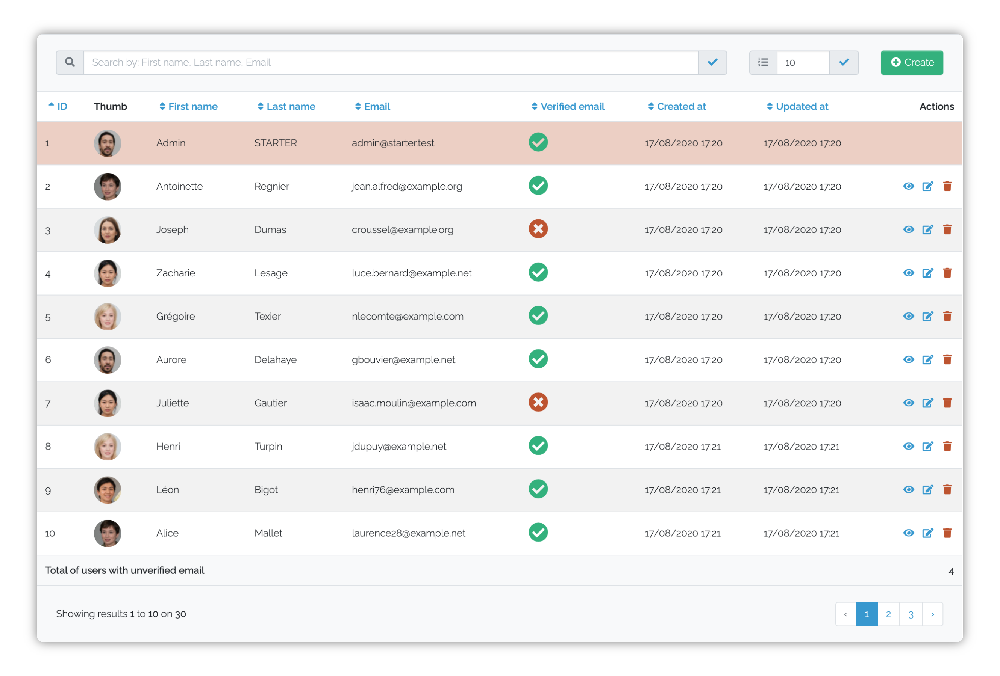

<p align="center">
    <a href="https://github.com/Okipa/laravel-table/releases" title="Latest Stable Version">
        
    </a>
    <a href="https://packagist.org/packages/Okipa/laravel-table" title="Total Downloads">
        
    </a>
    <a href="https://github.com/Okipa/laravel-table/actions" title="Build Status">
        
    </a>
    <a href="https://coveralls.io/github/Okipa/laravel-table?branch=master" title="Coverage Status">
        
    </a>
    <a href="/LICENSE.md" title="License: MIT">
        
    </a>
</p>



Easily render tables from Eloquent models in your views.
  
This package is shipped with a pre-configuration for `Bootstrap 4.*` and `FontAwesome 5` but can be fully reconfigured to work with any UI framework.

Found this package helpful? Please consider supporting my work!

[](https://ko-fi.com/arthurlorent)
[](https://paypal.me/arthurlorent)

## Compatibility

| Laravel version | PHP version | Package version |
|---|---|---|
| ^7.0 | ^7.4 | ^4.0 |
| ^7.0 | ^7.4 | ^3.0 |
| ^6.0 | ^7.4 | ^2.0 |
| ^5.8 | ^7.2 | ^1.3 |
| ^5.5 | ^7.1 | ^1.0 |

## Upgrade guide

* [From V3 to V4](/docs/upgrade-guides/from-v3-to-v4.md)
* [From V2 to V3](/docs/upgrade-guides/from-v2-to-v3.md)
* [From V1 to V2](/docs/upgrade-guides/from-v1-to-v2.md)

## Usage

Create your table class with the following command:

```bash
php artisan make:table UsersTable --model=App/Models/User
```

Set your table configuration in the generated file, which can be found in the `app\Tables` directory:

```php
namespace App\Tables;

use Okipa\LaravelTable\Abstracts\AbstractTable;
use Okipa\LaravelTable\Table;
use App\Models\User;

class UsersTable extends AbstractTable
{
    protected function table(): Table
    {
        return (new Table())->model(User::class)
            ->routes([
                'index' => ['name' => 'users.index'],
                'create' => ['name' => 'user.create'],
                'edit' => ['name' => 'user.edit'],
                'destroy' => ['name' => 'user.destroy'],
            ])
            ->destroyConfirmationHtmlAttributes(fn(User $user) => [
                'data-confirm' => __('Are you sure you want to delete the user :name ?', [
                    'name' => $user->name
                ])
            ]);
    }

    protected function columns(Table $table): void
    {
        $table->column('id')->sortable(true);
        $table->column('name')->sortable()->searchable();
        $table->column('email')->sortable()->searchable();
        $table->column('created_at')->dateTimeFormat('d/m/Y H:i', 'Europe/Paris')->sortable();
        $table->column('updated_at')->dateTimeFormat('d/m/Y H:i', 'Europe/Paris')->sortable();
    }
}
```

Send the table to your view:

```php
use \Illuminate\View\View;
use \App\Tables\UsersTable;

class UsersController
{
    public function index(): View
    {
        $table = (new UsersTable())->setup();
    
        return view('templates.users.index', compact('table'));
    }
}

```

Finally, display it in the view:

```blade
{{ $table }}
```

## Table of contents

* [Installation](#installation)
* [Configuration](#configuration)
* [Templates](#templates)
* [Translations](#translations)
* [Advanced configuration example](#advanced-configuration-example)
* [Tips](#tips)
* [Table API](#table-api)
  * [model](#table-model)
  * [identifier](#table-identifier)
  * [request](#table-request)
  * [routes](#table-routes)
  * [destroyConfirmationHtmlAttributes](#table-destroyConfirmationHtmlAttributes)
  * [rowsNumber](#table-rowsNumber)
  * [activateRowsNumberDefinition](#table-activateRowsNumberDefinition)
  * [query](#table-query)
  * [appendData](#table-appendData)
  * [containerClasses](#table-containerClasses)
  * [tableClasses](#table-tableClasses)
  * [trClasses](#table-trClasses)
  * [thClasses](#table-thClasses)
  * [tdClasses](#table-tdClasses)
  * [rowsConditionalClasses](#table-rowsConditionalClasses)
  * [disableRows](#table-disableRows)
  * [tableTemplate](#table-tableTemplate)
  * [theadTemplate](#table-theadTemplate)
  * [rowsSearchingTemplate](#table-rowsSearchingTemplate)
  * [rowsNumberDefinitionTemplate](#table-rowsNumberDefinitionTemplate)
  * [createActionTemplate](#table-createActionTemplate)
  * [columnTitlesTemplate](#table-columnTitlesTemplate)
  * [tbodyTemplate](#table-tbodyTemplate)
  * [showActionTemplate](#table-showActionTemplate)
  * [editActionTemplate](#table-editActionTemplate)
  * [destroyActionTemplate](#table-destroyActionTemplate)
  * [resultsTemplate](#table-resultsTemplate)
  * [tfootTemplate](#table-tfootTemplate)
  * [navigationStatusTemplate](#table-navigationStatusTemplate)
  * [paginationTemplate](#table-paginationTemplate)
  * [column](#table-column)
  * [result](#table-result)
* [Column API](#column-api)
  * [classes](#column-classes)
  * [title](#column-title)
  * [sortable](#column-sortable)
  * [searchable](#column-searchable)
  * [dateTimeFormat](#column-dateTimeFormat)
  * [button](#column-button)
  * [link](#column-link)
  * [prependHtml](#column-prependHtml)
  * [appendsHtml](#column-appendsHtml)
  * [stringLimit](#column-stringLimit)
  * [value](#column-value)
  * [html](#column-html)
* [Result API](#result-api)
  * [title](#result-title)
  * [html](#result-html)
  * [classes](#result-classes)
* [Testing](#testing)
* [Changelog](#changelog)
* [Contributing](#contributing)
* [Credits](#credits)
* [Licence](#license)

## Installation

* Install the package with composer:

```bash
composer require okipa/laravel-table
```

## Configuration

Optionally publish the package configuration:

```bash
php artisan vendor:publish --tag=laravel-table:config
```

## Templates

Optionally publish the package templates:

```bash
php artisan vendor:publish --tag=laravel-table:views
```

## Translations

All words and sentences used in this package are translatable.

See how to translate them on the Laravel official documentation: https://laravel.com/docs/localization#using-translation-strings-as-keys.

Here is the list of the words and sentences available for translation:

* `Create`
* `Show`
* `Edit`
* `Destroy`
* `Number of rows`
* `Search by:`
* `Reset research`
* `Actions`
* `No results were found.`
* `Showing results <b>:start</b> to <b>:stop</b> on <b>:total</b>`

## Advanced configuration example

```php
namespace App\Tables;

use App\News;
use Illuminate\Support\Str;
use Illuminate\Http\Request;
use Illuminate\Database\Eloquent\Builder;
use Okipa\LaravelTable\Table;
use Okipa\LaravelTable\Abstracts\AbstractTable;

class NewsTable extends AbstractTable
{
    protected Request $request;

    protected int $categoryId;

    public function __construct(Request $request, int $categoryId)
    {
        $this->request = $request;
        $this->categoryId = $categoryId;
    }

    protected function table(): Table
    {
        return (new Table())->model(News::class)
            ->identifier('news-table')
            ->request($this->request)
            ->routes([
                'index' => ['name' => 'news.index'],
                'create' => ['name' => 'news.create'],
                'edit' => ['name' => 'news.edit'],
                'destroy' => ['name' => 'news.destroy'],
                'show' => ['name' => 'news.show'],
            ])
            ->rowsNumber(50) // Or set `null` to display all the items contained in database
            ->activateRowsNumberDefinition(false)
            ->query(function (Builder $query) {
                // Some examples of what you can do
                $query->select('news.*');
                // Add a constraint
                $query->where('category_id', $this->categoryId);
                // Get value stored in a json field
                $query->addSelect('news.json_field->>json_attribute as json_attribute');
                // Get a formatted value from a pivot table
                $query->selectRaw('count(comments.id) as comments_count');
                $query->leftJoin('news_commment', 'news_commment.news_id', '=', 'news.id');
                $query->leftJoin('comments', 'comments.id', '=', 'news_commment.comment_id');
                $query->groupBy('comments.id');
                // Alias a value to make it available from the column model
                $query->addSelect('users.name as author');
                $query->join('users', 'users.id', '=', 'news.author_id');
            })
            ->disableRows(fn(News $news) => in_array($news->id, [1, 2]), ['disabled', 'bg-secondary', 'text-white'])
            ->rowsConditionalClasses(fn(News $news) => $news->id === 3, ['highlighted', 'bg-success'])
            ->rowsConditionalClasses(
                fn(News $news) => $news->category,
                fn(News $news) => 'category-' . Str::snake($news->category)
            )
            // Append all request params to the paginator
            ->appendData($this->request->all());
    }
    
    protected function columns(Table $table): void
    {
        $table->column('id')->sortable(true);
        $table->column()->title(__('Illustration'))->html(fn(News $news) => $news->image_src
            ? 'image_src . '" alt="' .  $news->title . '">'
            : null);
        $table->column('title')->sortable()->searchable();
        $table->column('content')->stringLimit(30);
        $table->column('author')->sortable(true)->searchable('user', ['name']);
        $table->column('category_id')
            ->title(__('Category'))
            ->prependHtml('<i class="fas fa-hand-point-right"></i>')
            ->appendsHtml('<i class="fas fa-hand-point-left"></i>')
            ->button(['btn', 'btn-sm', 'btn-outline-primary'])
            ->value(fn(News $news) => config('news.category.' . $news->category_id))
        $table->column()
            ->title(__('Display'))
            ->link(fn(News $news) => route('news.show', $news))
            ->button(['btn', 'btn-sm', 'btn-primary']);
        $table->column('created_at')->dateTimeFormat('d/m/Y H:i', 'Europe/Paris')->sortable();
        $table->column('updated_at')->dateTimeFormat('d/m/Y H:i', 'Europe/Paris')->sortable();
        $table->column('published_at')->dateTimeFormat('d/m/Y H:i', 'Europe/Paris')->sortable(true, 'desc');
    }

    protected function resultLines(Table $table): void
    {
        $table->result()
            ->title('Total of comments')
            ->html(fn(Collection $paginatedRows) => $paginatedRows->sum('comments_count'));
    }
}
```

## Tips
* **Columns displaying combination:** The following table column methods can be chained to display a result as wished. If you can't get the wanted result, you should use the `html` method to build a custom display.
  * `button`
  * `link`
  * `prependHtml`
  * `appendsHtml`
  * `stringLimit`
  * `value`

## Table API

:warning: All the following methods are chainable with `\Okipa\LaravelTable\Table` object **except the [column](#table-column) and the [result](#table-result) methods** (returning respectively `\Okipa\LaravelTable\Column` and `\Okipa\LaravelTable\Result` objects).

<h3 id="table-model">model</h3>

> Set the model used during the table generation.

**Notes:**

* Signature: `model(string $tableModelNamespace): \Okipa\LaravelTable\Table`
* Required

**Use case example:**

```php
(new Table())->model(User::class);
```

<h3 id="table-identifier">identifier</h3>

> Set the table identifier, in order to automatically generate its id and to customize all the interaction fields in case of multiple tables used on a single view: the interactions with the table like sorting, searching an more will only have an impact on the identified table.

**Notes:**

* Signature: `identifier(string $identifier): \Okipa\LaravelTable\Table`
* Optional

**Use case example:**

```php
(new Table())->identifier('users-table');
```

<h3 id="table-request">request</h3>

> Set the request used for the table generation.

**Notes:**

* Signature: `request(Request $request): \Okipa\LaravelTable\Table`
* Optional: by default the table uses the current request given by the `request()` helper to get the number of lines to show and the searching, sorting or pagination data. However, if you need to pass a particular request, this method is for you.

**Use case example:**

Pass the request to your table:

```php
class UsersController
{
    public function index(\Illuminate\Http\Request $request)
    {
        $table = new UsersTable($request);
        // ...
    }
}
```

Then, use the custom request in your table:

```php
namespace App\Tables;

use App\Models\Users;
use Illuminate\Http\Request;
use Okipa\LaravelTable\Abstracts\AbstractTable;
use Okipa\LaravelTable\Table;

class UsersTable extends AbstractTable
{
    protected Request $request;

    public function __construct(Request $request)
    {
        $this->request = $request;
    }

    protected function table(): Table
    {
        return (new Table())->model(User::class)->request($this->request);
    }

    // ...
}
```

<h3 id="table-routes">routes</h3>

> Set the routes used during the table generation.  
> The routes declarations will be used for the following features:
>
> * `index` (required): this is where you will be redirected when you will change the number of displayed rows, when you will sort the table on a specific column, or when you will execute a search request.
> * `create` (optional): if declared, the **create** button will be displayed and will trigger this route on click.
> * `show` (optional): if declared, the **show** button will be displayed on each row (unless it is a disabled row) and will trigger this route on click.
> * `edit` (optional): if declared, the **edit** button will be displayed for each row (unless it is a disabled row) and will trigger this route on click.
> * `destroy` (optional): if declared, the **destroy** button will be displayed on each row (unless it is a disabled row) and will trigger this route on click.

**Note:**

* Signature: `routes(array $routes): \Okipa\LaravelTable\Table`
* Required
* Routes have to be defined with the following structure:

```php
// Example
[
    'index' => [
        // Required
        'name' => 'users.index',
        // Optional
        'params' => [
            // Set route params (or not)
        ]
    ]
    // You will have to respect the same structure for any declared route.
];
```

* As the current model instance is always provided as a param to the `show`, `edit` and `destroy` routes, you do not have to pass it to the params.
* You also should declare your routes carefully to avoid errors. See the examples bellow:

```php
    // Assuming your declared your route with implicit binding:
    Route::get('parent/{$parent}/user/edit/{$user}/child/{$child}', 'UsersController@edit')->name('user.edit');
    // You will have to declare your params with keys as following:
    (new Table())->model(User::class)->routes([
        // ...
        'edit'    => ['name'=> 'user.edit', 'params' => ['parent' => $parent, 'child' => $child]],
        // ...
    ]);
    // Because the route will be generated with the table related model as first param (the params order differs from the declaration):
    route('user.edit', [$user, 'parent' => $parent, 'child' => $child]);
```

```php
    // Now imagine your route is declared with the table related model as first param like this:
    Route::get('/user/edit/{$user}/child/{$child}/{otherParam}', 'UsersController@edit')->name('user.edit');
    // In this case only, you will be able to declare your routes without keys:
    (new Table())->model(User::class)->routes([
        // ...
        'edit'    => ['name'=> 'user.edit', 'params' => [$child, 'otherParam']],
        // ...
    ]);
    // Because the route params are given in the same order as the route declaration:
    route('user.edit', [$user, $child, 'otherParam']);
```

**Use case example:**

```php
(new Table())->routes([
    'index' => ['name' => 'news.index'],
    'create' => ['name' => 'news.create', 'params' => ['param1' => 'value1']],
    'edit' => ['name' => 'news.edit', 'params' => ['param2' => 'value2']],
    'destroy' => ['name' => 'news.destroy'],
    'show' => ['name' => 'news.show'],
]);
```

<h3 id="table-rowsNumber">rowsNumber</h3>

> Override the config default number of rows displayed on the table.  
> The default number of displayed rows is defined in the `config('laravel-table.behavior.rows_number')` config value.  
> Set `null` to display all the models contained in database.

**Note:**

* Signature: `rowsNumber(?int $rowsNumber): \Okipa\LaravelTable\Table`
* Optional

**Use case example:**

```php
(new Table())->rowsNumber(50);
// Or
(new Table())->rowsNumber(null);
```

<h3 id="table-activateRowsNumberDefinition">activateRowsNumberDefinition</h3>

> Override the default rows number definition activation status.  
> Calling this method displays a rows number input that enable the user to choose how much rows to show.  
> The default rows number definition activation status is managed by the `config('laravel-table.behavior.activate_rows_number_definition')` value.

**Note:**`

* Signature: `activateRowsNumberDefinition($activate = true): \Okipa\LaravelTable\Table`
* Optional

**Use case example:**

```php
(new Table())->activateRowsNumberDefinition(false);
```

<h3 id="table-query">query</h3>

> Set the query closure that will be executed during the table generation.  
> For example, you can define your joined tables here.  
> The closure let you manipulate the following attribute: `\Illuminate\Database\Eloquent\Builder $query`.

**Note:**

* Signature: `query(Closure $additionalQueriesClosure): \Okipa\LaravelTable\Table`
* Optional

**Use case example:**

```php
(new Table())->query(function(Builder $query){
    $query->select('users.*');
    $query->addSelect('companies.name as company');
    $query->join('users', 'users.id', '=', 'companies.owner_id');
});
```

<h3 id="table-appendData">appendData</h3>

> Add an array of arguments that will be appended to the paginator and to the following table actions:
>
> * row number definition
> * searching
> * search cancelling
> * sorting.

**Note:**

* Signature: `appendData(array $appendedToPaginator): \Okipa\LaravelTable\Table`
* Optional

**Use case example:**

```php
(new Table())->appendData(request()->only('status'));
```

<h3 id="table-containerClasses">containerClasses</h3>

> Override default table container classes.  
> The default container classes are defined in the `config('laravel-table.classes.container')` config value.

**Note:**

* Signature: `containerClasses(array $containerClasses): \Okipa\LaravelTable\Table`
* Optional

**Use case example:**

```php
(new Table())->containerClasses(['set', 'your', 'classes']);
```

<h3 id="table-tableClasses">tableClasses</h3>

> Override default table classes.  
> The default table classes are defined in the `config('laravel-table.classes.table')` config value.

**Note:**

* Signature: `tableClasses(array $tableClasses): \Okipa\LaravelTable\Table`
* Optional

**Use case example:**

```php
(new Table())->tableClasses(['set', 'your', 'classes']);
```

<h3 id="table-trClasses">trClasses</h3>

> Override default table tr classes.  
> The default tr classes are defined in the `config('laravel-table.classes.tr')` config value.

**Note:**

* Signature: `trClasses(array $trClasses): \Okipa\LaravelTable\Table`
* Optional

**Use case example:**

```php
(new Table())->trClasses(['set', 'your', 'classes']);
```

<h3 id="table-thClasses">thClasses</h3>

> Override default table tr classes.  
> The default th classes are defined in the `config('laravel-table.classes.th')` config value.

**Note:**

* Signature: `thClasses(array $thClasses): \Okipa\LaravelTable\Table`
* Optional

**Use case example:**

```php
(new Table())->thClasses(['set', 'your', 'classes']);
```

<h3 id="table-tdClasses">tdClasses</h3>

> Override default table td classes.  
> The default td classes are defined in the `config('laravel-table.classes.td')` config value.

**Note:**

* Signature: `tdClasses(array $tdClasses): \Okipa\LaravelTable\Table`
* Optional

**Use case example:**

```php
(new Table())->tdClasses(['set', 'your', 'classes']);
```

<h3 id="table-rowsConditionalClasses">rowsConditionalClasses</h3>

> Set rows classes when the given conditions are respected.  
> The closures let you manipulate the following attribute: `\Illuminate\Database\Eloquent\Model $model`.

**Note:**

* Signature: `rowsConditionalClasses(Closure $rowClassesClosure, array|Closure $rowClasses): \Okipa\LaravelTable\Table`
* Optional

**Use case example:**

```php
(new Table())->rowsConditionalClasses(fn(User $user) => $model->hasParticularAttribute, ['set', 'your', 'classes']);

// Or

(new Table())->rowsConditionalClasses(
    fn(User $user) => $model->hasParticularAttribute,
    fn(User $user) => 'dynamic-class-name-' . $model->particularAttribute
);
```

<h3 id="table-destroyConfirmationHtmlAttributes">destroyConfirmationHtmlAttributes</h3>

> Define html attributes on the destroy buttons to handle dynamic javascript destroy confirmations.  
> The closure let you manipulate the following attribute: `\Illuminate\Database\Eloquent\Model $model`.  
> **Beware:** the management of the destroy confirmation is on you, if you do not setup a javascript treatment to ask a confirmation, the destroy action will be directly executed.

**Note:**

* Signature: `destroyConfirmationHtmlAttributes(Closure $destroyConfirmationClosure): \Okipa\LaravelTable\Table`
* Optional (but strongly recommended !)

**Use case example:**

```php
(new Table())->destroyHtmlAttributes(fn(User $user) => ['data-confirm' => __('Are you sure you want to delete the user :name ?', ['name' => $user->name])]);
```

**Javascript snippet example:**

```javascript
// Example of javascript snippet to ask a confirmation before executing the destroy action
// This js snippet uses the `data-confirm` attribute value provided in the use case example above
const destroyButtons = $('table form.destroy-action button[data-confirm]');
destroyButtons.click((event) => {
    event.preventDefault();
    const $this = $(event.target);
    const $destroyButton = $this.is('button') ? $this : $this.closest('button');
    const message = $destroyButton.data('confirm');
    const form = $destroyButton.closest('form');
    if (message && confirm(message)) {
        form.submit();
    }
});
```

<h3 id="table-disableRows">disableRows</h3>

> Set the disableRows closure that will be executed during the table generation.  
> The optional second param let you override the classes that will be applied for the disabled rows.  
> By default, the « config('laravel-table.classes.disabled') » config value is applied.  
> For example, you can disable the current logged user to prevent him being edited or deleted from the table.  
> The closure let you manipulate the following attribute: `\Illuminate\Database\Eloquent\Model $model`.

**Note:**

* Signature: `disableRows(Closure $rowDisableClosure, array $classes = []): \Okipa\LaravelTable\Table`
* Optional

**Use case example:**

```php
(new Table())->disableRows(fn(User $user) => $user->id = auth()->id(), ['bg-danger', 'text-primary']);
```

<h3 id="table-tableTemplate">tableTemplate</h3>

> Set a custom view path for the table template.  
> The default view path is defined in the `config('laravel-table.template.table')` config value.

**Note:**

* Signature: `tableTemplate(string $tableTemplatePath): \Okipa\LaravelTable\Table`
* Optional

**Use case example:**

```php
(new Table())->tableTemplate('tailwindCss.table');
```

<h3 id="table-theadTemplate">theadTemplate</h3>

> Set a custom view path for the thead template.  
> The default view path is defined in the `config('laravel-table.template.thead')` config value.

**Note:**

* Signature: `theadTemplate(string $theadTemplatePath): \Okipa\LaravelTable\Table`
* Optional

**Use case example:**

```php
(new Table())->theadTemplate('tailwindCss.thead');
```

<h3 id="table-rowsSearchingTemplate">rowsSearchingTemplate</h3>

> Set a custom view path for the rows searching template.  
> The default view path is defined in the `config('laravel-table.template.rows_searching')` config value.

**Note:**

* Signature: `rowsSearchingTemplate(string $rowsSearchingTemplatePath): \Okipa\LaravelTable\Table`
* Optional

**Use case example:**

```php
(new Table())->rowsSearchingTemplate('tailwindCss.rows-searching');
```

<h3 id="table-rowsNumberDefinitionTemplate">rowsNumberDefinitionTemplate</h3>

> Set a custom view path for the rows number definition template.  
> The default view path is defined in the `config('laravel-table.template.rows_number_definition')` config value.

**Note:**

* Signature: `rowsNumberDefinitionTemplate(string $rowsNumberDefinitionTemplatePath): \Okipa\LaravelTable\Table`
* Optional

**Use case example:**

```php
(new Table())->rowsSearchingTemplate('tailwindCss.rows-number-definition');
```

<h3 id="table-createActionTemplate">createActionTemplate</h3>

> Set a custom view path for the create action template.  
> The default view path is defined in the `config('laravel-table.template.create_action')` config value.

**Note:**

* Signature: `createActionTemplate(string $createActionTemplatePath): \Okipa\LaravelTable\Table`
* Optional

**Use case example:**

```php
(new Table())->createActionTemplate('tailwindCss.create-action');
```

<h3 id="table-columnTitlesTemplate">columnTitlesTemplate</h3>

> Set a custom view path for the column titles template.  
> The default view path is defined in the `config('laravel-table.template.column_titles')` config value.

**Note:**

* Signature: `columnTitlesTemplate(string $columnTitlesTemplatePath): \Okipa\LaravelTable\Table`
* Optional

**Use case example:**

```php
(new Table())->columnTitlesTemplate('tailwindCss.column-titles');
```

<h3 id="table-tbodyTemplate">tbodyTemplate</h3>

> Set a custom view path for the tbody template.  
> The default view path is defined in the `config('laravel-table.template.tbody')` config value.

**Note:**

* Signature: `tbodyTemplate(string $tbodyTemplatePath): \Okipa\LaravelTable\Table`
* Optional

**Use case example:**

```php
(new Table())->tbodyTemplate('tailwindCss.tbody');
```

<h3 id="table-showActionTemplate">showActionTemplate</h3>

> Set a custom view path for the show template.  
> The default view path is defined in the `config('laravel-table.template.show_action')` config value.

**Note:**

* Signature: `showActionTemplate(string $showActionTemplatePath): \Okipa\LaravelTable\Table`
* Optional

**Use case example:**

```php
(new Table())->showActionTemplate('tailwindCss.show-action');
```

<h3 id="table-editActionTemplate">editActionTemplat</h3>

> Set a custom view path for the edit template.  
> The default view path is defined in the `config('laravel-table.template.edit_action')` config value.

**Note:**

* Signature: `editActionTemplate(string $editActionTemplatePath): \Okipa\LaravelTable\Table`
* Optional

**Use case example:**

```php
(new Table())->editActionTemplate('tailwindCss.edit-action');
```

<h3 id="table-destroyActionTemplate">destroyActionTemplate</h3>

> Set a custom view path for the destroy template.  
> The default view path path is defined in the `config('laravel-table.template.destroy_action')` config value.

**Note:**

* Signature: `destroyActionTemplate(string $destroyActionTemplatePath): \Okipa\LaravelTable\Table`
* Optional

**Use case example:**

```php
(new Table())->destroyActionTemplate('tailwindCss.destroy-action');
```

<h3 id="table-resultsTemplate">resultsTemplate</h3>

> Set a custom view path for the results template.  
> The default results template path is defined in the `config('laravel-table.template.results')` config value.

**Note:**

* Signature: `resultsTemplate(string $resultsTemplatePath): \Okipa\LaravelTable\Table`
* Optional

**Use case example:**

```php
(new Table())->resultsTemplate('tailwindCss.results');
```

<h3 id="table-tfootTemplate">tfootTemplate</h3>

> Set a custom view path for the tfoot template.  
> The default tfoot template path is defined in the `config('laravel-table.template.tfoot')` config value.

**Note:**

* Signature: `tfootTemplate(string $tfootTemplatePath): \Okipa\LaravelTable\Table`
* Optional

**Use case example:**

```php
(new Table())->tfootTemplate('tailwindCss.tfoot');
```

<h3 id="table-navigationStatusTemplate">navigationStatusTemplate</h3>

> Set a custom view path for the navigation status template.  
> The default tfoot template path is defined in the `config('laravel-table.template.navigation_status')` config value.

**Note:**

* Signature: `navigationStatusTemplate(string $navigationStatusTemplatePath): \Okipa\LaravelTable\Table`
* Optional

**Use case example:**

```php
(new Table())->navigationStatusTemplate('tailwindCss.navigation-status');
```

<h3 id="table-paginationTemplate">paginationTemplate</h3>

> Set a custom view path for the pagination template.  
> The default tfoot template path is defined in the `config('laravel-table.template.pagination')` config value.

**Note:**

* Signature: `paginationTemplate(string $paginationTemplatePath): \Okipa\LaravelTable\Table`
* Optional

**Use case example:**

```php
(new Table())->paginationTemplate('tailwindCss.pagination');
```

<h3 id="table-column">column</h3>

> Add a column that will be displayed in the table.  
> The column key is optional if the column is not declared as sortable or searchable.

**Note:**

* Signature: `column(string $dbField = null): \Okipa\LaravelTable\Column`
* Required
* **Warning:** this method should not be chained with the other `\Okipa\LaravelTable\Table` methods because it returns a `\Okipa\LaravelTable\Column` object. See the use case examples to check how to use this method.

**Use case example:**

```php
$table->column('name');
```

<h3 id="table-result">result</h3>

> Add a result row that will be displayed at the bottom of the table.

**Note:**

* Signature: `result(): Result`
* Optional
* **Warning:** this method should not be chained with the other `\Okipa\LaravelTable\Table` methods because it returns a `\Okipa\LaravelTable\Result` object. See the use case examples to check how to use this method.

**Use case example:**

```php
$table->result();
```

## Column API

:warning: All the column methods are chainable with `\Okipa\LaravelTable\Column` object.

<h3 id="column-classes">classes</h3>

> Set the custom classes that will be applied on this column only.

**Note:**

* Signature: `classes(array $classes): \Okipa\LaravelTable\Column`
* Optional

**Use case example:**

```php
$table->column()->classes(['font-weight-bold']);
```

<h3 id="column-title">title</h3>

> Set a custom column title and override the default `__('validation.attributes.[$database_column])` one.

**Note:**

* Signature: `title(string $title = null): \Okipa\LaravelTable\Column`
* Optional

**Use case example:**

```php
$table->column()->title('E-mail');
```

<h3 id="column-sortable">sortable</h3>

> Make the column sortable.  
> You also can choose to set the column sorted by default.  
> If no column is sorted by default, the first one will be automatically sorted.

**Note:**

* Signature: `sortable(bool $sortByDefault = false, $sortDirection = 'asc'): \Okipa\LaravelTable\Column`
* Optional

**Use case example:**

```php
$table->column('email')->sortable();

// Alternative
$table->column('email')->sortable(true, 'desc');
```

<h3 id="column-searchable">searchable</h3>

> Make the column searchable.  
> The first param allows you to precise the searched database table (can references a database table alias).  
> The second param allows you to precise the searched database attributes (if not precised, the table database column is searched).

**Note:**

* Signature: `searchable(string $dbSearchedTable = null, array $dbSearchedFields = []): \Okipa\LaravelTable\Column`
* Optional

**Use case example:**

```php
// Example 1
$table->column('email')->searchable();

// Example 2
$table = (new Table())->model(User::class)->query(function(Builder $query) {
    $query->select('users.*');
    $query->addSelect('companies.name as company');
    $query->join('companies', 'companies.owner_id', '=', 'users.id');
});
$table->column('company')->searchable('companies', ['name']);

// Example 3
$table = (new Table())->model(User::class)->query(function(Builder $query) {
    $query->select('users.*');
    $query->addSelect(\DB::raw('CONCAT(companies.name, " ", companies.activity) as company'));
    $query->join('companies as companiesAliasedTable', 'companies.owner_id', '=', 'users.id');
});
$table->column('company')->searchable('companiesAliasedTable', ['name', 'activity']);
```

<h3 id="column-dateTimeFormat">dateTimeFormat</h3>

> Set the format for a datetime, date or time database column (optional).  
> (Carbon::parse($value)->timezone($timezone)->format($format) method is used under the hood).

**Note:**

* Signature: `dateTimeFormat(string $dateTimeFormat, string $timezone = null): \Okipa\LaravelTable\Column`
* Optional
* If no timezone is set, the default one, defined in `config('app.timezone')` is used

**Use case example:**

```php
$table->column('created_at')->dateTimeFormat('d/m/Y H:i', 'Europe/Paris');
```

<h3 id="column-button">button</h3>

> Display the column as a button with the given classes.

**Note:**

* Signature: `button(array $buttonClasses = []): \Okipa\LaravelTable\Column`
* Optional

**Use case example:**

```php
$table->column('email')->button(['btn', 'btn-sm', 'btn-primary']);
```

<h3 id="column-link">link</h3>

> Wrap the column value into a `<a></a>` HTML tag.  
> You can declare the link as a string or as a closure which will let you manipulate the following attribute: `\Illuminate\Database\Eloquent\Model $model`.  
> If no url is declared, the url will be generated using the column value.

**Note:**

* Signature: `link($url = null): \Okipa\LaravelTable\Column`
* Optional

**Use case example:**

```php
// Example 1
$table->column('url')->link();

// Example 2
$table->column()->link(route('news.index'));

// Example 3
$table->column()->link(function(News $news) {
    return route('news.show', $news);
});
```

<h3 id="column-prependHtml">prependHtml</h3>

> Prepend HTML to the displayed value.  
> Set the second param as true if you want the prepended HTML to be displayed even if the column has no value.

**Note:**

* Signature: `prependHtml(string $prependedHtml, bool $forcePrependedHtmlDisplay = false): \Okipa\LaravelTable\Column`
* Optional

**Use case example:**

```php
$table->column('email')->prependHtml('<i class="fas fa-envelope"></i>', true);
```

<h3 id="column-appendsHtml">appendsHtml</h3>

> Append HTML to the displayed value.  
> Set the second param as true if you want the appended HTML to be displayed even if the column has no value.

**Note:**

* Signature: `appendsHtml(string $appendedHtml, bool $forceAppendedHtmlDisplay = false): \Okipa\LaravelTable\Column`
* Optional

**Use case example:**

```php
$table->column('email')->appendsHtml('<i class="fas fa-envelope"></i>', true);
```

<h3 id="column-stringLimit">stringLimit</h3>

> Set the string value display limitation.  
> Shows "..." when the limit is reached.

**Note:**

* Signature: `stringLimit(int $stringLimit): \Okipa\LaravelTable\Column`
* Optional

**Use case example:**

```php
$table->column('email')->stringLimit(30);
```

<h3 id="column-value">value</h3>

> Display a custom value for the column.  
> The closure let you manipulate the following attributes: `\Illuminate\Database\Eloquent\Model $model`.

**Note:**

* Signature: `value(Closure $customValueClosure): \Okipa\LaravelTable\Column`
* Optional

**Use case example:**

```php
$table->column()->value(function(User $user) {
    return config('users.type.' . $user->type_id);
});
```

<h3 id="column-html">html</h3>

> Display a custom HTML for the column.  
> The closure let you manipulate the following attributes: `\Illuminate\Database\Eloquent\Model $model`.

**Note:**

* Signature: `html(Closure $customHtmlClosure): \Okipa\LaravelTable\Column`
* Optional

**Use case example:**

```php
$table->column()->html(function(User $user) {
    return '<div>' . $user->first_name . '</div>';
});
```

## Result API

:warning: All the result methods are chainable with `\Okipa\LaravelTable\Result` object.

<h3 id="result-title">title</h3>

> Set the result row title.

**Note:**

* Signature: `title(string $title): \Okipa\LaravelTable\Result`
* Optional

**Use case example:**

```php
$table->result()->title('Turnover total');
```

<h3 id="result-html">html</h3>

> Display a HTML output for the result row.  
> The closure let you manipulate the following attributes: `\Illuminate\Support\Collection $paginatedRows`.

**Note:**

* Signature: `html(Closure $customHtmlClosure): \Okipa\LaravelTable\Result`
* Optional

**Use case example:**

```php
$table->result()->html(function(Collection $paginatedRows) {
    return $paginatedRows->sum('turnover');
});
```

<h3 id="result-classes">classes</h3>

> Override the default results classes and apply the given classes only on this result row.  
> The default result classes are managed by the `config('laravel-table.classes.results')` value.

**Note:**

* Signature: `classes(array $classes): \Okipa\LaravelTable\Result`
* Optional

**Use case example:**

```php
$table->result()->classes(['bg-dark', 'text-white', 'font-weight-bold']);
```

## Testing

```bash
composer test
```

## Changelog

Please see [CHANGELOG](CHANGELOG.md) for more information on what has changed recently.

## Contributing

Please see [CONTRIBUTING](CONTRIBUTING.md) for details.

## Credits

* [Arthur LORENT](https://github.com/okipa)
* [All Contributors](../../contributors)

## License

The MIT License (MIT). Please see [License File](LICENSE.md) for more information.
